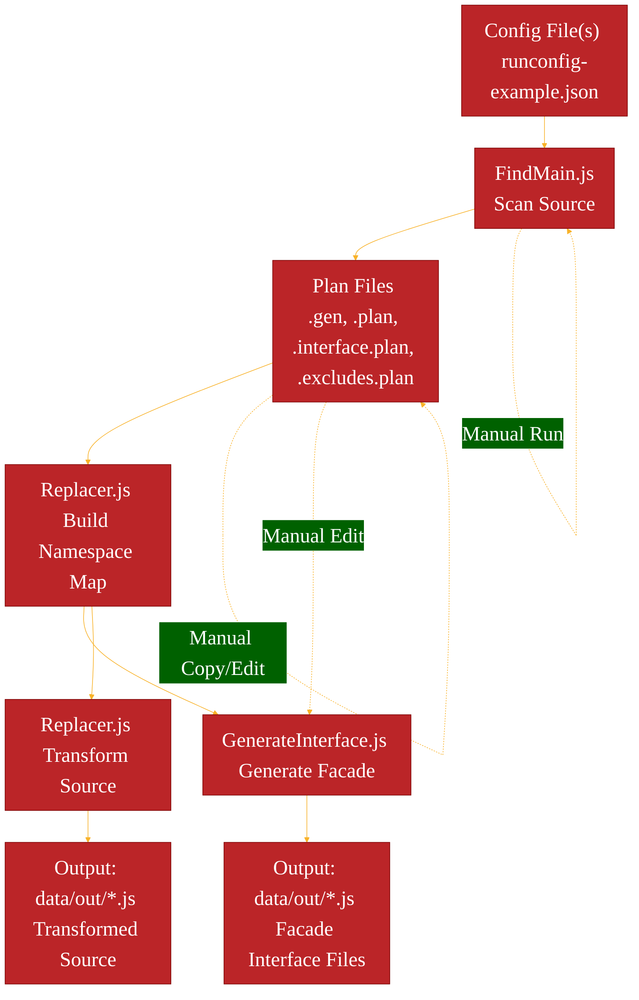
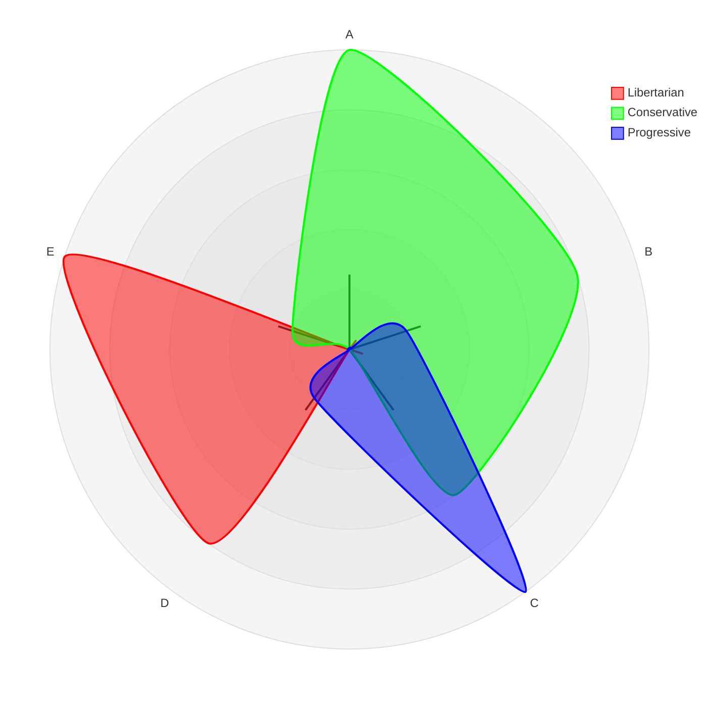

# Mermaid high-level flow diagrams

1. Copilot generated data flow as of 20260306 with links
    * these links won't open source files, as they are, but may open URLs in the future.

# Links: 

These links are markdown links and will open files in the VSCode editor from markdown preview:

1. Data Flow
    * Config file sets options for FindMain: [runconfig-example.json](../runconfig-example.json) 
    * Every run produces an [accumulator.plan](../data/plans/accumulator.plan)

2. Application Plan Flow
    * PlanRunner reads FindMain's config file: [runconfig-example.json](../runconfig-example.json) 
    * PlanRunner executes FindMain