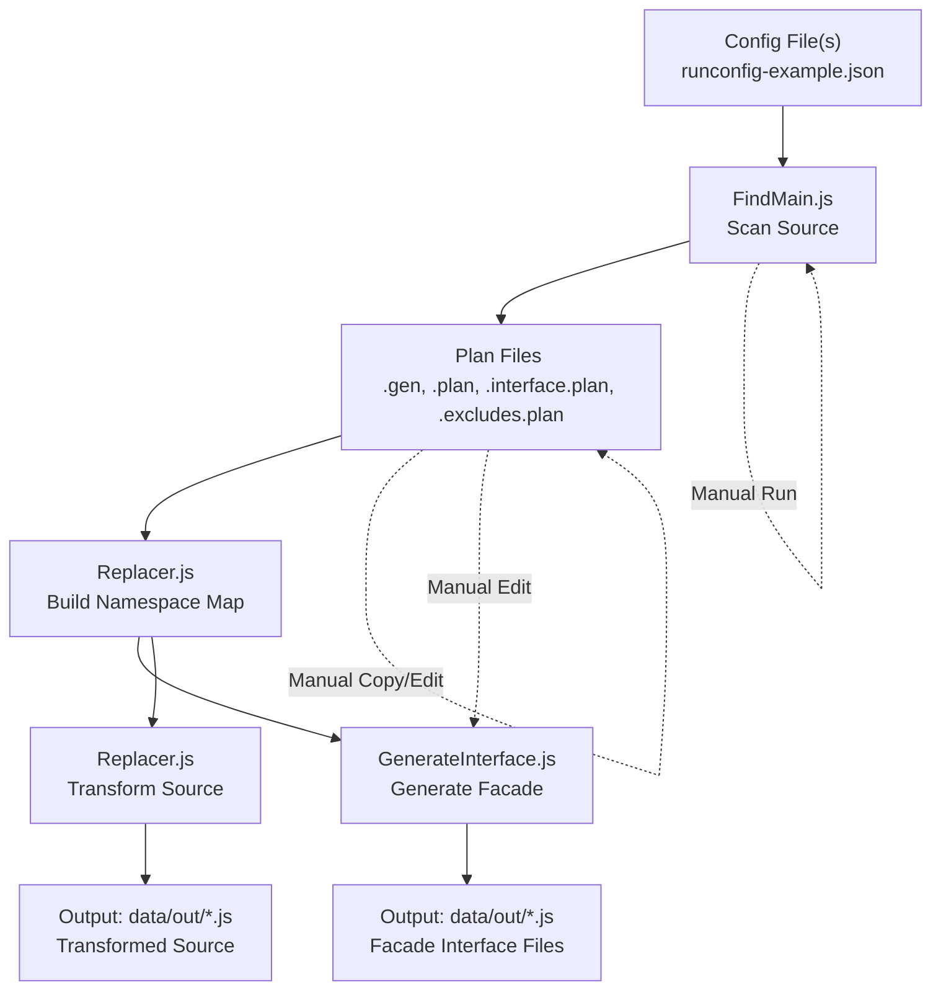

# Original Chat Request

User: Hi!  I'm getting ready to integrate my project, and would love to have you analyze the flow, especially the data flow as the application picks up config files and source files from the filesystem, and what processing it does, what generation of files that are similar in name with different extensions that are then saved.  If you can spot where the intention is to process such files, but no implementation actually happens, that would be very useful.

The purpose of this application is to scan Javascript source files in data/src/, and look for identifiers that are coming from the global scope, so that these identifiers can be namespace qualified for migration to ES6. Other files in source are scaned for export function and function declarations, and are compiled in a master map.  This map is used to generate Facade Interface files that represent the namespace.  That namespace, which is really the class name of the Facade, is then used to qualify callers that seem to be invocations, yet don't declare these identifiers in their own file.  There are various inclusion and exclusion files that have been designed but not populated. The module FindMain can run standalone to preview these files, look for functions, export functions, and identifiers.  When it is run successfully, the developer saves the config used to run it with --writeconfig.  PlanRunner assembles this config so it can run FindMain as the Search of Search-and-Replace.  It then calls Replacer to both run the generation of Interface files, e.g. IColorFunctions.js for colorFunctions.js.  song.js is the prototypical caller/invoker of identifiers.  infinite-neck.js is the prototypical exporter of functions, many of which are not exported properly in the ES6 world, but do provide those functions to the global space when run in the plain Javascript world.

The legacy codebase is in project root ~/infinite-neck.  However, all the .js files in that root directory are a completely separate project.  It is the target project of this migration tool, "namespacer".  What we are looking at analyzing today is the project in ~/infinite-neck/bin/namespacer/.  namespacer owns a data/ directory, where it has samples of the legacy code in data/src/ and has plan documents such as lists of identifiers to include and exclude in data/plans/ and will use data/tmp/ for generated files that end in file extension  ".gen", and final output versions searched, replaced, and namespaced in data/out. Some .gen files have been manually copied to data/plans, and that workflow may become part of PlanRunner's duties.  It also may stay part of the developer's workflow, using FindMain from the command line.

Given these explanations, please analyze the codebase and see if you can produce the artifacts I mentioned, suitable for me as a senior developer to read, or as any senior developer tasked with finishing the project, or software development manager would read to understand the project and scope of work needed to complete it. 

Please let me know if I may provide any information to aid the analysis.

Thanks!

GitHub Copilot: Searched for files matching `**/bin/namespacer/**/*.js`, 11 matches

Searched for regex `require\(|import |export |function |module.exports|fs\.|readFile|writeFile|readDir|writeFileSync|readFileSync|writeFileSync|writeFile|readFile|process|config|plan|gen|out|tmp|src|namespace|Facade|interface|global|identifier|main|runner|replace|generate|save|load` (`**/bin/namespacer/**/*.js`), 100 results

Searched for regex `data\/src|data\/plans|data\/tmp|data\/out|\.gen|\.js|\.json|\.config|\.plan` (`**/bin/namespacer/**/*.js`), 100 results

Created 4 todos

Read [](file:///home/laramie/infinite-neck/bin/namespacer/PlanRunner.js)

Read [](file:///home/laramie/infinite-neck/bin/namespacer/Replacer.js#1-1), lines 1 to 90

Read [](file:///home/laramie/infinite-neck/bin/namespacer/Replacer.js#91-91), lines 91 to 180

Read [](file:///home/laramie/infinite-neck/bin/namespacer/Replacer.js#181-181), lines 181 to 270

Read [](file:///home/laramie/infinite-neck/bin/namespacer/Replacer.js#271-271), lines 271 to 311

Read [](file:///home/laramie/infinite-neck/bin/namespacer/FindMain.js#1-1), lines 1 to 80

Read [](file:///home/laramie/infinite-neck/bin/namespacer/FindMain.js#81-81), lines 81 to 160

Read [](file:///home/laramie/infinite-neck/bin/namespacer/FindMain.js#161-161), lines 161 to 240

Read [](file:///home/laramie/infinite-neck/bin/namespacer/FindMain.js#241-241), lines 241 to 320

Read [](file:///home/laramie/infinite-neck/bin/namespacer/FindMain.js#321-321), lines 321 to 400

Read [](file:///home/laramie/infinite-neck/bin/namespacer/FindMain.js#401-401), lines 401 to 445

Read [](file:///home/laramie/infinite-neck/bin/namespacer/GenerateInterface.js#1-1), lines 1 to 60

Read [](file:///home/laramie/infinite-neck/bin/namespacer/GenerateInterface.js#61-61), lines 61 to 111

Read [](file:///home/laramie/infinite-neck/bin/namespacer/SourceFile.js)

Read [](file:///home/laramie/infinite-neck/bin/namespacer/FindOptions.js#1-1), lines 1 to 60

Read [](file:///home/laramie/infinite-neck/bin/namespacer/FindOptions.js#61-61), lines 61 to 120

Read [](file:///home/laramie/infinite-neck/bin/namespacer/FindOptions.js#121-121), lines 121 to 191

Read [](file:///home/laramie/infinite-neck/bin/namespacer/RegexSuites.js#1-1), lines 1 to 60

Read [](file:///home/laramie/infinite-neck/bin/namespacer/RegexSuites.js#61-61), lines 61 to 120

Starting: *Identify config, plan, and output file usage* (2/4)

Here is a high-level analysis of the data flow, file processing, and artifact generation in your namespacer project, with a focus on config, plan, and output file usage:

---

## Data Flow & File Processing

### 1. **Configuration and Plan Files**
- **Config files** (e.g., `runconfig-example.json`) are used to drive the main processing flow. They specify which files to scan, what regex suites to use, and output options.
- **Plan files** in `data/plans/` (e.g., `song.js.functions.gen`, `IColorFunctions.js.interface.plan`) list identifiers, functions, or exclusions for each namespace/module.

### 2. **Source Scanning**
- **FindMain.js** is the entry point for scanning source files in `data/src/`. It uses regex suites (from RegexSuites.js) to find:
  - Function declarations (exported and non-exported)
  - Top-level invocations (potential global usages)
  - Exports and other relevant patterns
- Results are accumulated and can be output as bare lists, summaries, or detailed logs.

### 3. **Master Namespace Map Generation**
- **Replacer.js** loads plan files and exclusions, building a `masterNamespaceMap` that maps identifiers to their intended namespace/class (e.g., `ISong`, `IColorFunctions`).
- This map is used to qualify global identifiers in source files.

### 4. **Interface Generation**
- **GenerateInterface.js** uses the plan files to generate ES6 Facade Interface files (e.g., `IColorFunctions.js` in `data/out/`), which wrap legacy implementations and expose only the intended API.

### 5. **Source Transformation**
- **Replacer.js** processes each source file listed in the plan, replacing global invocations with namespace-qualified calls, and writes the transformed files to `data/out/`.

---

## File Types and Locations

- **Config:** `runconfig-example.json`, other `.json` files (in project root or `data/`)
- **Source:** `data/src/*.js` (legacy code to be scanned and transformed)
- **Plan:** `data/plans/*.gen`, `*.plan`, `*.interface.plan`, `*.excludes.plan` (lists of functions, interfaces, exclusions)
- **Temp/Gen:** `data/tmp/*.gen` (intermediate/generated files, not always used directly)
- **Output:** `data/out/*.js` (final transformed and interface files)

---

## Missing or Unimplemented Steps

- **SourceFile.js** has a `write()` method that is not implemented, but all writing is currently done directly via `writeFileSync`.
- **Plan file population**: Some plan files are expected to be generated by running FindMain, but the workflow for moving `.gen` files to `.plan` or `.interface.plan` is not fully automated.
- **Manual steps**: The copying of `.gen` files to plans, and editing of `.interface.plan` files, is not fully integrated into PlanRunner or automated scripts.
- **Exclusion/inclusion logic**: The system is designed to use exclusion lists, but many are empty or not yet populated.
- **Error handling**: Some error cases (e.g., missing config, empty plan files) are logged but may not halt processing or provide actionable feedback.

---

## Artifacts for Senior Developer/Manager

### 1. **Data Flow Diagram**
- Config → FindMain (scans source, generates plan files) → Plan files → Replacer (builds namespace map, generates interfaces, transforms sources) → Output files

### 2. **Key Classes/Modules**
- FindMain.js: Scans source, generates lists
- Replacer.js: Builds namespace map, generates interfaces, transforms sources
- GenerateInterface.js: Creates ES6 Facade classes
- PlanRunner.js: Orchestrates the above, using config

### 3. **Completion Scope**
- **Automated scanning and mapping**: Implemented
- **Interface generation**: Implemented
- **Source transformation**: Implemented
- **Plan file management**: Partially manual, could be automated
- **Exclusion/inclusion population**: Needs developer input

---

Would you like a visual diagram, a checklist for remaining work, or a more detailed breakdown of any specific part?

User: Yes, if you can provide a visual diagram and checklist, those would be very helpful.  Then I can evaluate your report and drill down from there.  Thanks!


GitHub Copilot: 

Starting: *Spot missing or unimplemented processing steps* (3/4)

Here is a visual diagram of the data flow in your namespacer project:

```mermaid
graph TD
    A[Config File(s)\n(runconfig-example.json)] --> B[FindMain.js\n(Scan Source)]
    B --> C[Plan Files\n(.gen, .plan, .interface.plan, .excludes.plan)]
    C --> D[Replacer.js\n(Build Namespace Map)]
    D --> E[GenerateInterface.js\n(Generate Facade)]
    D --> F[Replacer.js\n(Transform Source)]
    E --> G[Output: data/out/*.js\n(Facade/Interface Files)]
    F --> H[Output: data/out/*.js\n(Transformed Source)]
    C -. Manual Copy/Edit .-> C
    C -. Manual Edit .-> E
    B -. Manual Run .-> B
```

---

### Checklist for Remaining Work

**Automated/Implemented:**
- [x] Config-driven scanning and processing
- [x] Source scanning for functions, exports, invocations
- [x] Plan file and namespace map generation
- [x] Interface (Facade) file generation
- [x] Source transformation and output

**Manual/Needs Improvement:**
- [ ] Automate copying/editing of `.gen` files to `.plan`/`.interface.plan`
- [ ] Populate and maintain exclusion/inclusion lists
- [ ] Integrate manual plan file edits into PlanRunner or workflow scripts
- [ ] Implement error handling for missing/empty plan/config files
- [ ] Document workflow for developers (when to run, what to edit, etc.)

Would you like a more detailed breakdown of any checklist item or a drill-down into a specific part of the flow?

User: Thank you for your offer to provide specifics and drill-down.  I'll get back to you when I have ingested your excellent work so far!

GitHub Copilot: You're welcome! I'm glad the analysis and artifacts were helpful. Whenever you're ready to dive deeper or need specifics on any part of the workflow, just let me know. Good luck with your integration and review!


User: After debugging some requirements of "Markdown Preview Mermaid Support" v1.32.0, here is an updated version of your diagram: 

