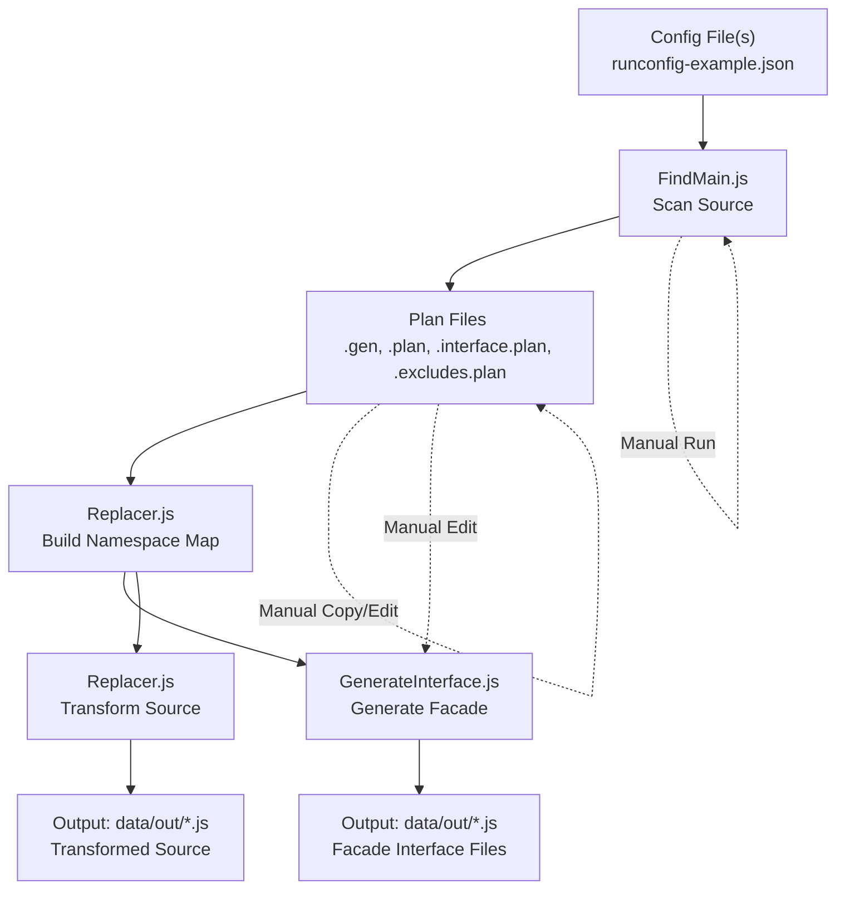

# namespacer Project Overview

## This document's version: V2

## Project Purpose

The **namespacer** project is a migration and refactoring tool designed to scan legacy JavaScript source files, identify global-scope identifiers, and namespace-qualify them for ES6 module compatibility. It automates the generation of Facade Interface files and transforms source code to use proper ES6 import/export patterns.

---

## Goals

One of the main goals is to preserve a maintainable branch of the codebase to support the current version.  Every full run of a Plan will transform the existing codebase as copied into data/src to the codebase in data/out.  Any issues found in this process should be addressed in the original source code in the project root, then copied into data/src and the Plan re-run.  In this way, we preserve a maintainable current version until migration is complete and tested.

---

## Data Flow Diagram



---

## Key Directories & Files

- [namespacer source directory](../)
- [documentation (doco) directory](../doco/)
- [data directory](../data/)
    - [plans](../data/plans/)
    - [src](../data/src/)
    - [out](../data/out/)
    - [tmp](../data/tmp/)
- [runconfig-example.json](../runconfig-example.json)

### Main Source Files
- [PlanRunner.js](../PlanRunner.js)
- [FindMain.js](../FindMain.js)
- [Replacer.js](../Replacer.js)
- [GenerateInterface.js](../GenerateInterface.js)
- [SourceFile.js](../SourceFile.js)
- [RegexSuites.js](../RegexSuites.js)
- [FindOptions.js](../FindOptions.js)

### Example Plan and Output Files
- [IColorFunctions.js.interface.plan](../data/plans/IColorFunctions.js.interface.plan)
- [ISong.js.excludes.plan](../data/plans/ISong.js.excludes.plan)
- [accumulator.plan](../data/plans/accumulator.plan)
- [colorFunctions.js.functions.gen](../data/plans/colorFunctions.js.functions.gen)
- [IColorFunctions.js](../data/out/IColorFunctions.js)
- [ISong.js](../data/out/ISong.js)

---

## Project Workflow Summary

1. **Interface Generation**: [GenerateInterface.js](../GenerateInterface.js) creates ES6 Facade Interface files in [out](../data/out/), and updates function exports as needed.
2. **Source Scanning**: Run [FindMain.js](../FindMain.js) to scan [src](../data/src/) files for functions, exports, and global usages. Outputs plan files in [plans](../data/plans/).
3. **Source Transformation**: [Replacer.js](../Replacer.js) rewrites source files with namespace-qualified identifiers and outputs to [out](../data/out/).

---

## Checklist for Remaining Work

**Automated/Implemented:**
- [x] Config-driven scanning and processing
- [x] Source scanning for functions, exports, invocations
- [x] Plan file and namespace map generation
- [x] Interface (Facade) file generation
- [x] Source transformation and output

**Manual/Needs Improvement:**
- [ ] Automate copying/editing of `.gen` files to `.plan`/`.interface.plan`
- [ ] Populate and maintain exclusion/inclusion lists
- [ ] Integrate manual plan file edits into PlanRunner or workflow scripts
- [ ] Implement error handling for missing/empty plan/config files
- [ ] Document workflow for developers (when to run, what to edit, etc.)

---

## Experimental Strategies

### Overview

To improve traceability and planning, we propose extending the Accumulator to capture structured plan steps and file I/O events. This will help document the workflow, support debugging, and enable future automation or reporting.

### Recommendations

1. **Add Accumulator.addPlanStep()**
    - Accepts an object describing the plan step, including:
        - `action`: (string) High-level description (e.g., "read source file", "generate interface file")
        - `sourceFile`: (string) The main file being processed (if applicable)
        - `generatedFiles`: (array of strings) Files created as a result of this step
        - `relatedPlans`: (array of strings) Plan or config files involved
        - `timestamp`: (optional, Date or ISO string)
        - `details`: (optional, object) Any extra context
    - Example usage:
      ```js
      Accumulator.addPlanStep({
        action: "generate interface file",
        sourceFile: "colorFunctions.js",
        generatedFiles: ["IColorFunctions.js"],
        relatedPlans: ["IColorFunctions.js.interface.plan"],
        timestamp: new Date().toISOString(),
        details: { method: "GenerateInterface.js" }
      });
      ```

2. **Track File I/O**
    - Wrap or instrument file read/write operations to call `addPlanStep()` with appropriate metadata.
    - For example, when writing a `.gen` or `.plan` file, log the source and output.

3. **Integrate in PlanRunner Steps**
    - In PlanRunner, for each major step (Search, Generate Interfaces, Replace), call `addPlanStep()` summarizing the action and files involved.
    - For each source processed, log the chain of events (input, plans consulted, outputs generated).

4. **Data Structure Proposal**
    - The accumulator should maintain an array of plan steps, e.g.:
      ```js
      [
        {
          action: "read source file",
          sourceFile: "song.js",
          generatedFiles: [],
          relatedPlans: ["song.js.functions.gen"],
          timestamp: "2026-03-06T12:34:56.789Z",
          details: { method: "FindMain.js" }
        },
        {
          action: "generate interface file",
          sourceFile: "colorFunctions.js",
          generatedFiles: ["IColorFunctions.js"],
          relatedPlans: ["IColorFunctions.js.interface.plan"],
          timestamp: "2026-03-06T12:35:10.123Z",
          details: { method: "GenerateInterface.js" }
        }
      ]
      ```
    - This can be exported as JSON for reporting or debugging.

5. **Top-Level Structure**
    - Consider grouping plan steps by source file or by workflow phase (Search, Generate, Replace) for easier navigation.
    - Example:
      ```js
      {
        sources: {
          "song.js": [ /* plan steps for song.js */ ],
          "colorFunctions.js": [ /* ... */ ]
        },
        interfaces: {
          "IColorFunctions.js": [ /* ... */ ]
        }
      }
      ```

### TODO: Dive/Surface API for File I/O Grouping

- Implement a `dive(sourceFileID)` / `surface(sourceFileID)` API pair in the Accumulator.
    - Every file I/O or plan step should occur within a tracked depth context.
    - When processing a file (e.g., "song.js"), call `dive('song.js')` before any related file I/O or plan steps.
    - All file I/O and plan steps are then grouped under the current dive context.
    - After finishing with the file, call `surface('song.js')`.
    - If `surface()` is called without a matching `dive()`, log a warning for debugging.
    - This will help group and visualize all actions related to a specific file, and spot any mismatches or unexpected flows.

- Update workflow steps order:
    1. Generate Interfaces and function exports
    2. Search
    3. Replace
    - Ensure this order is reflected in documentation and future code updates.

### Questions for Next Iteration

1. Should plan steps be grouped by source file, by phase, or both?
2. What level of detail is most useful in the plan step log (minimal, or include all file I/O)?
3. Should file I/O tracking be automatic (e.g., via wrapper functions) or explicit in code?
4. Would you like to export the accumulator data as a separate JSON artifact for external tools or reporting?
5. Are there privacy or performance concerns with logging all file operations?
6. Should the accumulator support hierarchical steps (parent/child relationships) for complex workflows?

---

## References
- [namespacer-doco-plan-flow-chat.md](./namespacer-doco-plan-flow-chat.md) — Full planning chat and analysis
- [namespacer-doco-specifications.md](./namespacer-doco-specifications.md) — This specification document
- [namespacer-overview-example.md](./namespacer-overview-example.md) — Example overview with working links

---

*This document is generated and maintained by GitHub Copilot as a living roadmap for the namespacer project. Please update as the project evolves.*