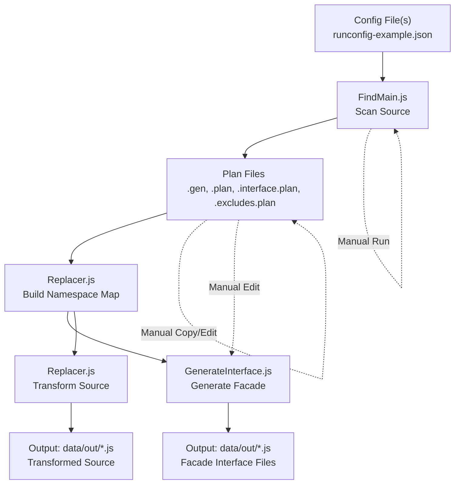

# namespacer Project Overview

## This document's version: V1

## Project Purpose

The **namespacer** project is a migration and refactoring tool designed to scan legacy JavaScript source files, identify global-scope identifiers, and namespace-qualify them for ES6 module compatibility. It automates the generation of Facade Interface files and transforms source code to use proper ES6 import/export patterns.

---

## Data Flow Diagram

---

## Key Directories & Files

- [namespacer source directory](../)
- [documentation (doco) directory](../doco/)
- [data directory](../data/)
    - [plans](../data/plans/)
    - [src](../data/src/)
    - [out](../data/out/)
    - [tmp](../data/tmp/)
- [runconfig-example.json](../runconfig-example.json)

### Main Source Files
- [PlanRunner.js](../PlanRunner.js)
- [FindMain.js](../FindMain.js)
- [Replacer.js](../Replacer.js)
- [GenerateInterface.js](../GenerateInterface.js)
- [SourceFile.js](../SourceFile.js)
- [RegexSuites.js](../RegexSuites.js)
- [FindOptions.js](../FindOptions.js)

### Example Plan and Output Files
- [IColorFunctions.js.interface.plan](../data/plans/IColorFunctions.js.interface.plan)
- [ISong.js.excludes.plan](../data/plans/ISong.js.excludes.plan)
- [accumulator.plan](../data/plans/accumulator.plan)
- [colorFunctions.js.functions.gen](../data/plans/colorFunctions.js.functions.gen)
- [IColorFunctions.js](../data/out/IColorFunctions.js)
- [ISong.js](../data/out/ISong.js)

---

## Project Workflow Summary

1. **Configuration**: Edit [runconfig-example.json](../runconfig-example.json) to specify source files, regex suites, and output options.
2. **Source Scanning**: Run [FindMain.js](../FindMain.js) to scan [src](../data/src/) files for functions, exports, and global usages. Outputs plan files in [plans](../data/plans/).
3. **Plan Management**: Review and, if needed, manually copy or edit `.gen` files to `.plan` or `.interface.plan` files in [plans](../data/plans/).
4. **Namespace Mapping**: [Replacer.js](../Replacer.js) builds a master namespace map from plan files and applies transformations.
5. **Interface Generation**: [GenerateInterface.js](../GenerateInterface.js) creates ES6 Facade Interface files in [out](../data/out/).
6. **Source Transformation**: [Replacer.js](../Replacer.js) rewrites source files with namespace-qualified identifiers and outputs to [out](../data/out/).

---

## Checklist for Remaining Work

**Automated/Implemented:**
- [x] Config-driven scanning and processing
- [x] Source scanning for functions, exports, invocations
- [x] Plan file and namespace map generation
- [x] Interface (Facade) file generation
- [x] Source transformation and output

**Manual/Needs Improvement:**
- [ ] Automate copying/editing of `.gen` files to `.plan`/`.interface.plan`
- [ ] Populate and maintain exclusion/inclusion lists
- [ ] Integrate manual plan file edits into PlanRunner or workflow scripts
- [ ] Implement error handling for missing/empty plan/config files
- [ ] Document workflow for developers (when to run, what to edit, etc.)

---

## References
- [namespacer-doco-plan-flow-chat.md](./namespacer-doco-plan-flow-chat.md) — Full planning chat and analysis
- [namespacer-doco-specifications.md](./namespacer-doco-specifications.md) — This specification document
- [namespacer-overview-example.md](./namespacer-overview-example.md) — Example overview with working links

---

*This document is generated and maintained by GitHub Copilot as a living roadmap for the namespacer project. Please update as the project evolves.*